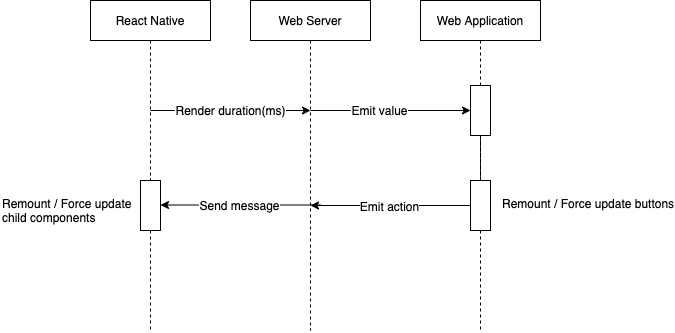

This project lets you see a realtime graph of render times within your React Native app. The purpose is for you to be able to create experiments (i.e. change markup and see how it affects render times).


# Installation

```
npm i react-native-performance-monitor --save
npx react-native-performance-monitor get
```


# Usage
```
import withPerformanceMonitor from 'react-native-performance-monitor/provider';
export default withPerformanceMonitor(YourScreen, 'Screen Name');
```

# An example

Set your baseline at http://127.0.0.1:8125/ by clicking remount. Pause the recorder, and adjust your component with what you think will improve performance.


Here's a before and after with this approach

Baseline
```
<Text style={[this.props.style]}>
    {this.props.children}
</Text>
```

Improved
```
<Text style={this.props.style}>
    {this.props.children}
</Text>
```

With this before and after I observed the following within a large flat list. 


# Connecting to a real device

In order to connect to a real device you will need to set the IP of your computer, for example:

```
export default withPerformanceMonitor(AwesomeChat, 'AwesomeChat', '192.168.1.10');
```

# How it works

The overall implementation is quite straight forward and simply involved passing the onRenderCallback values via a websocket server to finally render them in a fancy graph.

There are 3 main components:

- A [React Native component](https://github.com/BulletTrainHQ/react-native-performance-monitor/blob/master/lib/provider.js) that sends profile data to a server via REST and listens to messages (remount and forceUpdate) to trigger renders.
- A [Web socket server](https://github.com/BulletTrainHQ/react-native-performance-monitor/blob/master/lib/src/server.js) responsible for passing messages between the graph and the react native component
- A [Web application](https://github.com/BulletTrainHQ/react-native-performance-monitor/blob/master/components/App.js) that receives websocket values and renders them to a graph

The following diagram is a brief explanation of the data flow:


