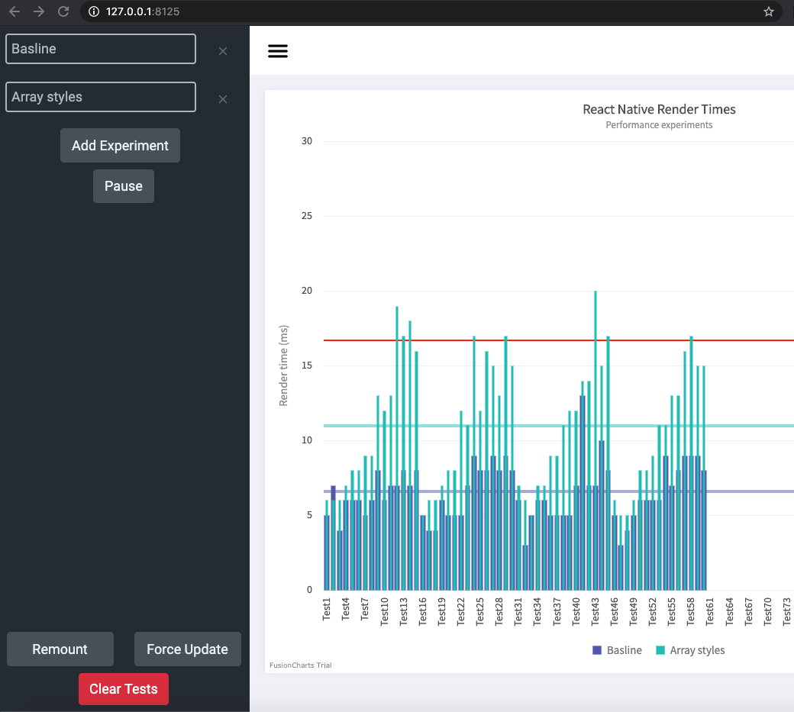

This project lets you see a realtime graph of render times within your React Native app. The purpose is for you to be able to create experiments (i.e. change markup and see how it affects render times).


# Installation

```
npm i react-native-performance-monitor --save
npx react-native-performance-monitor get
```


# Usage
```
import withPerformanceMonitor from 'react-native-performance-monitor/provider';
export default withPerformanceMonitor({WrappedComponent: YourScreen, _id: 'Screen Name'});
```

# An example

Set your baseline at http://127.0.0.1:8125/ by clicking remount. Pause the recorder, and adjust your component with what you think will improve perormance.


Here's a before and after with this approach

Baseline
```
<Text style={[this.props.style]}>
    {this.props.children}
</Text>
```

Improved
```
<Text style={this.props.style}>
    {this.props.children}
</Text>
```

With this before and after I observed the following within a large flat list. 


